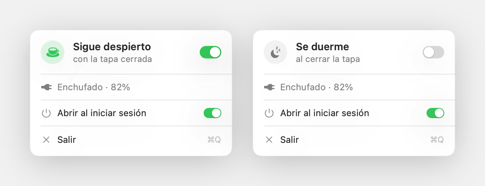
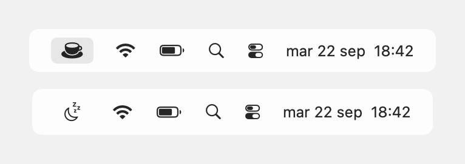
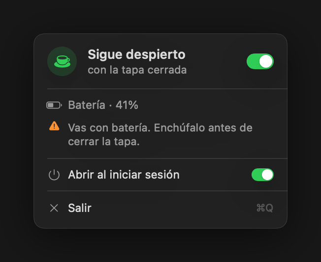

# Tapadera

Cierras el portátil y sigue trabajando. Nada más.



---

## El problema

Un portátil se duerme al cerrar la tapa. Da igual que dentro haya una compilación
a medias, un `rsync` de 40 GB o un agente escribiendo código: bajas la pantalla y
todo se detiene.

`caffeinate` no resuelve esto. Impide que el equipo se duerma **por inactividad**,
que es un mecanismo distinto del cierre de tapa. Con la tapa bajada, el sistema
suspende igual.

Tapadera desactiva ese comportamiento concreto, y lo vuelve a activar cuando terminas.
El nombre va por ahí: la tapa del portátil, y la tapadera como fachada. El equipo
aparenta estar dormido y por dentro sigue a lo suyo.

---

## La app de macOS

Vive en la barra de menús. Un icono, un interruptor, ningún icono en el Dock.



Taza cuando está despierto, luna cuando duerme. Se lee de un vistazo sin abrir nada.

El panel muestra la fuente de alimentación y la batería, se refresca solo, y avisa si
activas el modo yendo sin enchufe — que es la forma habitual de descubrir a media
tarde que la sesión murió al 3 %.



El interruptor de arranque escribe un agente de `launchd` en tu carpeta de usuario,
así que Tapadera vuelve sola tras reiniciar. Quitarlo lo borra: no deja rastro en
el sistema.

### Instalación

Descarga `Tapadera.app` de la [última versión](https://github.com/marcosdeaza/tapadera/releases/latest)
y muévela a Aplicaciones. Es un binario universal, Apple Silicon e Intel.

La app está firmada ad-hoc, no con un certificado de desarrollador de Apple —
eso cuesta 99 € al año y esto es una utilidad de 300 KB. Por eso la primera vez
hay que abrirla con clic derecho > **Abrir** en lugar de doble clic. Una sola vez.

---

## La herramienta de línea de órdenes

El mismo concepto, sin interfaz, en los tres sistemas.

### Instalación

En macOS y Linux, de una línea:

```sh
curl -fsSL https://raw.githubusercontent.com/marcosdeaza/tapadera/main/install.sh | sh
```

En Windows, descarga `tapadera-windows-x86_64.zip` de la
[última versión](https://github.com/marcosdeaza/tapadera/releases/latest) y pon el
`.exe` en alguna carpeta de tu `PATH`.

### Uso

```
tapadera on        no dormir al cerrar la tapa
tapadera off       volver al comportamiento normal
tapadera toggle    alternar
tapadera status    estado actual (código 0 activo, 1 inactivo)
```

`status` devuelve su resultado por el código de salida, así que encadena bien:

```sh
tapadera status || tapadera on
```

Cambiar el estado toca la configuración de energía del sistema y necesita
privilegios de administrador (`sudo` en macOS y Linux, consola elevada en Windows).
Leerlo no.

---

## Cómo funciona por dentro

No hay nada mágico ni ningún demonio residente. Tapadera escribe el ajuste que
cada sistema ya tiene y se aparta.

| Sistema | Mecanismo | Qué toca |
| --- | --- | --- |
| macOS | `pmset` | `disablesleep`, el ajuste que ignora el cierre de tapa |
| Windows | `powercfg` | acción al cerrar la tapa del plan activo, en red y en batería |
| Linux | systemd-logind | `HandleLidSwitch=ignore` en `/etc/systemd/logind.conf.d/99-tapadera.conf` |

En Linux el archivo se borra entero al desactivar, y se recarga `logind` para que
el cambio surta efecto sin reiniciar.

El binario no tiene dependencias — solo la biblioteca estándar de Rust — y pesa
unos 300 KB.

---

## Compilar

**Aplicación de macOS.** Necesita las herramientas de línea de órdenes de Xcode.

```sh
cd macos && ./build.sh
```

Compila para las dos arquitecturas, une los binarios con `lipo`, genera el `.icns`,
arma el bundle y lo firma. Sale en `macos/build/Tapadera.app`.

**Herramienta multiplataforma.** Necesita Rust.

```sh
cd cli && cargo build --release
```

**Imágenes de esta página.** Se generan a partir de las vistas reales de la app,
no son capturas ni maquetas:

```sh
swiftc -O -parse-as-library -DSHOTS -o /tmp/shots tools/shots.swift macos/Sources/App.swift
/tmp/shots docs/images
```

Es deliberado: si cambia el panel, la documentación cambia con él o deja de compilar.

---

## Advertencia

Con la tapa cerrada y el equipo despierto, el ventilador no tiene por dónde tirar el
calor. En una mesa no pasa nada. Dentro de una mochila, sí. Y en batería, el consumo
es el de un portátil a pleno rendimiento: enchúfalo.

---

## Licencia

MIT. Marcos de Aza.
